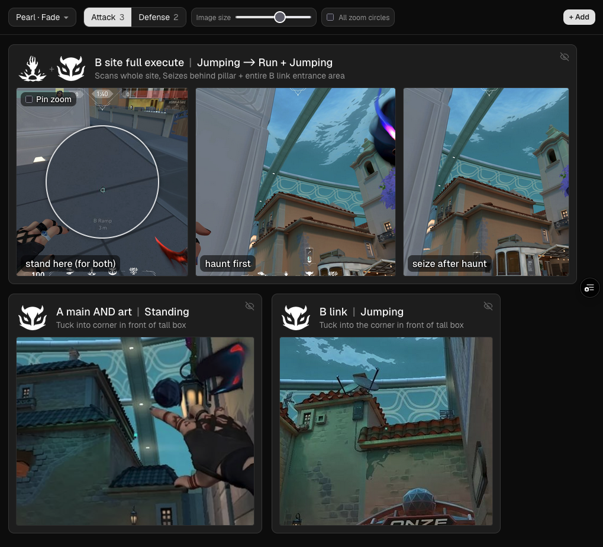
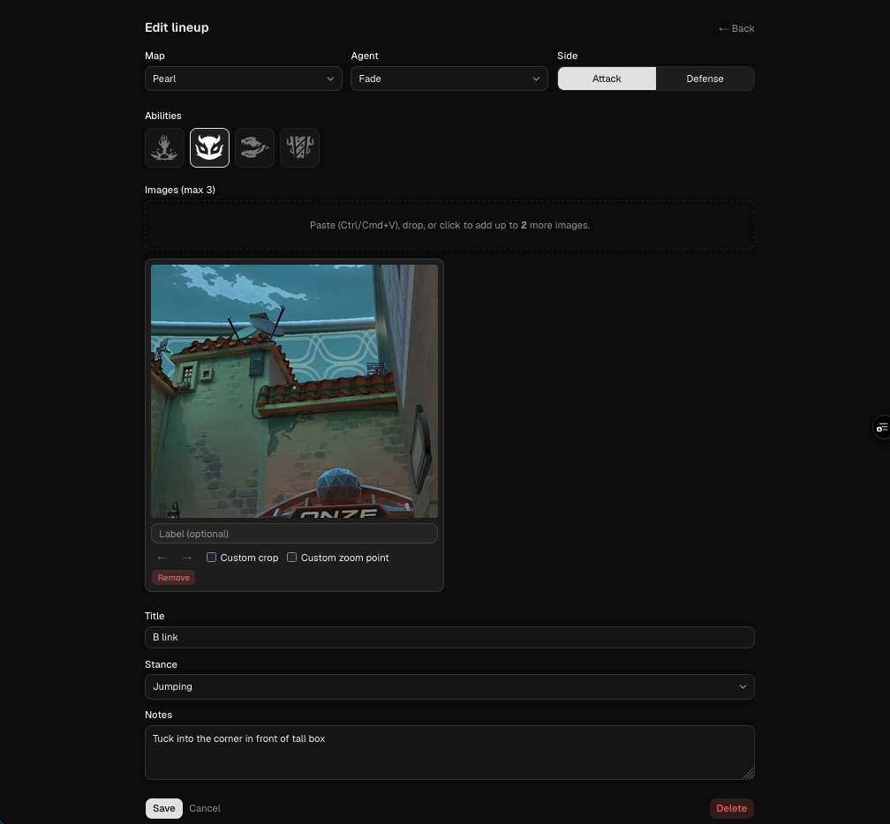

# Valolineups

A personal cheat-sheet site for Valorant lineups — screenshots and metadata stored alongside the map, agent, side, and ability they belong to, then filtered down to exactly what's relevant while you're in game.

**Live:** [valolineups.vercel.app](https://valolineups.vercel.app) — password-protected; the login page links you to my Discord if you need access.

## What it does

Stash a screenshot (or two, or three) for any lineup — a Sova dart, a Viper wall, a Killjoy ult spot — tagged with the map, agent, side, ability, and a short title. On match start, pick the map and agent and the cheat sheet narrows to just the lineups for that matchup. Toggle Attack ↔ Defense with a single click (or the `s` key).

Designed to be glanceable on a second monitor — no scrolling for the right info, no mouse hunting mid-round.

## Features

- **Map / agent / side filter bar** with a visual map+agent picker. Selections persist via URL and localStorage, so a bookmarked or back-navigated view comes back exactly as you left it.
- **Card grid** that auto-sizes by image count — a 3-image lineup spans 3 columns, a single screenshot spans 1 — so multi-shot lineups stay grouped and readable.
- **Per-card primary line** showing the ability icon, title (e.g. "shock dart A site"), and stance (e.g. "standing / jumping / crouching") at a glance.
- **Image inputs that match how you actually capture lineups:** paste from clipboard (cmd/ctrl+V), drag-and-drop, or tap to pick from camera roll on phone. Up to 3 images per lineup, auto-compressed in-browser before upload.
- **Local-zoom indicator** — drop an anchor on each image and the card shows a zoomed circle on the relevant spot. Useful for crosshair placement or smoke-line markers. Toggle "all zoom circles" to keep them on permanently, or hover any image to reveal one.
- **Per-image crop** — frame the card to just the relevant slice of the screenshot without losing the original image.
- **Adjustable image height** via a slider in the filter bar — make cards bigger on a 4K monitor, smaller on a laptop. Persisted per device.
- **Fullscreen image preview** — click any card image for a full-resolution overlay; `esc` closes it.
- **Ability tagging per lineup** — pick one or more of the agent's actual abilities (auto-derived from the agent, so Sova gets shock dart / recon / owl drone / hunter's fury). Slots that don't belong to the chosen agent are hidden.
- **Custom fields** — `title` and `stance` are the headline fields; add any other text/textarea field from the settings page (e.g. "notes", "execute timing") and it'll show up on the edit form for every lineup.
- **Multi-device sync** — edits made on your phone show up on your desktop when you tab back to the page, with no manual refresh.
- **Settings page** for renaming custom fields, reordering them, and flipping maps in/out of the competitive rotation.

## Stack (short version)

Next.js 16, Tailwind v4, Supabase (Postgres + Storage), deployed on Vercel Hobby. Auth is a single shared password gated by an HMAC cookie — no per-user accounts.

For developer setup, schema, and architecture details, see [CLAUDE.md](CLAUDE.md), [ARCHITECTURE.md](ARCHITECTURE.md), and [SPEC.md](SPEC.md).
